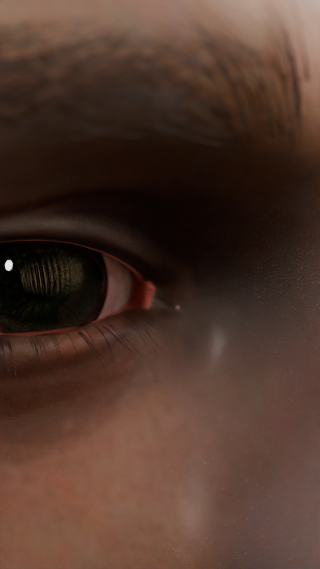
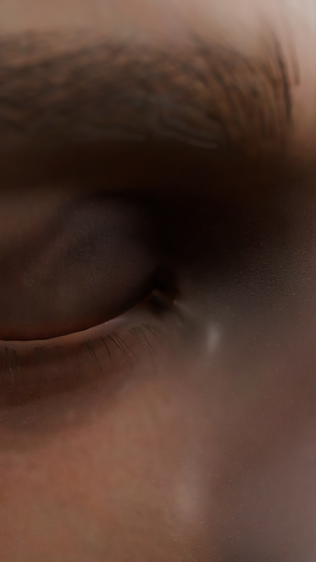
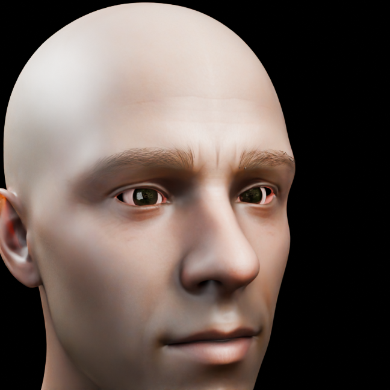
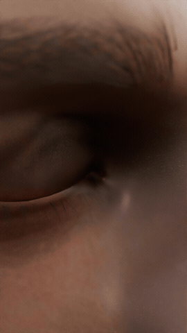

# Eye & Face Asset — photoreal eye close-up with procedural blink rig (Blender 5.2, Cycles)

A ready-to-use macro eye/face setup: scanned human head + **two** procedural rigged eyes,
with a **procedural eyelid blink** (shape keys + solvers), **eyelash follow**,
**physically based skin shader** (SSS, pores, oil sheen), **tear meniscus**, **peach fuzz**
over the whole face and a single **`EyeCtrl`** control object for blink / pupil / gaze / fuzz.
Open `eye_face_asset.blend` and press Render.

| macro, open (frame 40) | macro, closed (frame 1) | face, studio lights |
|---|---|---|
|  |  |  |

**Demo clips:** `demo_macro.mp4` / `demo_macro.gif` (the included 112-frame animation: heavy opening → flutter blink → gaze drift)
and `demo_face.mp4` / `demo_face.gif` (both eyes: blink, look_x / look_y sweep, pupil dilation, studio lights).

 

## What's inside
Everything lives in one root collection **`EyeFace`** (marked as an *Asset* with a preview, so it shows up in the
Asset Browser when you add this folder as an asset library):

| collection | contents |
|---|---|
| `HEAD` | `MetaHumanHead_Textured` — scanned head, 2K diffuse packed, skin shader v2, conjunctiva strips inside both lid margins |
| `EYES` | `Eyeball` / `Eyeball_L` + `Cornea` / `Cornea_L` under `Realistic Rigged Procedural Eye(_L)` — procedural iris/cornea rig (shape keys Pupil, Dilation, Slit …) |
| `LASHES` | `lashes_upper/lower(_L)` — geometry lashes (NURBS + bevel, no particles); `eyebrow(_L)` |
| `RIG` | `EyeCtrl` (the control), `eye_aim` / `eye_aim_L` (gaze targets), `cam_target`, `lash_pivot*` (lash follow pivots) |
| `FX` | `TearLine(_L)` — wet meniscus tube along the lower lid margin; `PeachFuzz` particle hair (45k, 0.5 mm, whole face) |
| `LIGHTS_XO` | the dramatic macro lighting used for the previews (default on) |
| `LIGHTS_Studio` | neutral key / fill / rim (excluded by default — tick it on in the Outliner for a clean look, untick `LIGHTS_XO`) |
| `CAMERAS` | `hero_socket` (macro, animated push-in, 1080×1920, 30 fps, frames 1–112) and `CAM_face` (both eyes, 70 mm) |

## Animate with `EyeCtrl`
Select the circle empty **`EyeCtrl`** (between the eyes) and keyframe its custom properties (N-panel → Object → Custom Properties):

| property | range | drives |
|---|---|---|
| `blink` | 0 open … 1 closed | both lids (`blink_close` / `blink_close_L` shape keys), lash follow, Bell's phenomenon (eyes roll up when closed), eyeball recess |
| `pupil` | 0 … 1 | iris `Dilation` of both eyes (0.75 = neutral) |
| `look_x` | −1 … 1 | gaze left / right (moves `eye_aim`, both eyes converge on it) |
| `look_y` | −1 … 1 | gaze down / up |
| `fuzz` | 0 / 1 | peach fuzz on/off (set 0 for a fast viewport & test renders) |

The file ships with demo keys on `blink` (heavy opening → flutter blink at fr 15–16 → open by fr 28) and a slow `look_x` drift.
Delete those keys and add your own. Do **not** keyframe the shape keys directly — they are driven.

How it works under the hood: the lids are a `blink_close` shape key plus an in-between `blink_arc` key (driven `4*v*(1-v)`);
`LidRelax` (Corrective Smooth) and `LidContact` (Shrinkwrap to the eyeball) keep the lid draped on the globe at every value.
Gaze is a `DAMPED_TRACK` (+Z = iris axis of this eye rig) to `eye_aim`, which sits 1 m in front of the face;
`look_x` / `look_y` offset it, `blink` lifts it (Bell's phenomenon). Lashes follow the lids through `CHILD_OF` constraints on the lash pivots.

## Skin & socket notes
- SSS random-walk, radius (1.0, 0.38, 0.19) × 3.7 mm, IOR 1.40, spec 0.55, coat 0.06/0.28 (oil),
  roughness = albedo×0.72 + noise, micro bump = Voronoi pores (2600/m) + fine noise wrinkles, redness mask near the lid margins.
- The scan's eye sockets are open holes into the head. A **conjunctiva strip** (material `Conjunctiva`) is extruded backwards
  from each lid margin and follows the blink, so there is no black gap between lid and eyeball at grazing angles
  (e.g. the far eye in a 3/4 view). The eyeballs sit 1.5 mm forward of the original placement so the lid margins rest on the globe.

## Reuse in your own project
1. **Asset Browser** (easiest): Preferences → File Paths → Asset Libraries → add this folder. In the Asset Browser drag
   **EyeFace** into your scene. Everything (drivers, constraints, materials, textures) comes along.
2. **Append**: File → Append → `eye_face_asset.blend` → Collection → `EyeFace`.
   Keep the whole collection together — the drivers reference `EyeCtrl`, the eyeballs, the pivots and the aim empties.
3. **Link + Library Override** if you want to keep pulling updates from this file.

Then parent `EyeFace`'s objects (or the whole collection instance) to your character's head bone/empty, point your own camera
at it, and animate `EyeCtrl`. Requires **Blender 5.2** (slotted actions: drivers/keys live in
`action.layers[0].strips[0].channelbag(slot)`); older Blender will not read the animation.

Render tips: Cycles, 64–128 samples with denoising is enough for the macro shot. Set `EyeCtrl.fuzz = 0` while animating.
Textures are packed; no external files needed.

## Scripts
`scripts/` holds the build scripts in the order they were run (reference only; not needed to use the asset):
01 blink shape key · 02 lid solvers + lash constraints · 03 skin shader, fuzz, tear line · 04 blink dynamics (flutter, Bell) ·
05 second eye (mirrored displacement field via KD-tree) · 06 EyeCtrl, collections, studio lights, whole-face fuzz ·
07 gaze rig + socket fix (track axis, eye depth, conjunctiva strip) · 08 face camera preview · 09 demo clips · 10 preview stills.

## Credits & licenses
- Head: BlenderKit "3D Scanned Human Head" (free, Royalty-Free license)
- Eye: BlenderKit "Realistic Rigged Procedural Eye" by Joshua Jennings (free, Royalty-Free)
- Blink rig, second-eye mirror, controls, lash system, skin shader, conjunctiva/tear line, fuzz, scripts: © Mikko Nurminen, MIT (see LICENSE)

**Note on the third-party assets:** the head and eye models come from BlenderKit under its
Royalty-Free license. Use them inside your own projects and renders; do not extract and
re-share the head or eye models on their own. If you are the author of either asset and
want it removed from this repository, open an issue and it will be taken down.
